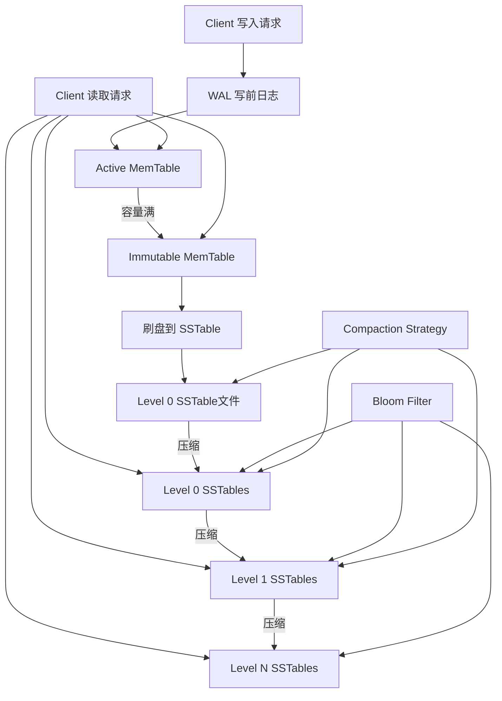
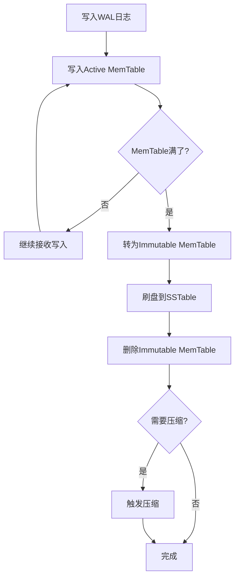
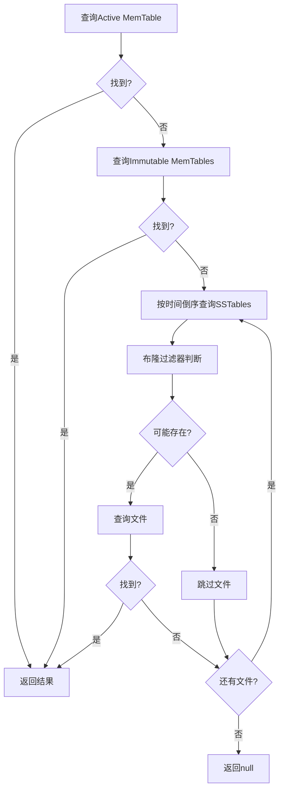

🔥 推荐一个高质量的Java LSM Tree开源项目！
[https://github.com/brianxiadong/java-lsm-tree](https://github.com/brianxiadong/java-lsm-tree)
**java-lsm-tree** 是一个从零实现的Log-Structured Merge Tree，专为高并发写入场景设计。
核心亮点：
⚡ 极致性能：写入速度超过40万ops/秒，完爆传统B+树
🏗️ 完整架构：MemTable跳表 + SSTable + WAL + 布隆过滤器 + 多级压缩
📚 深度教程：12章详细教程，从基础概念到生产优化，每行代码都有注释
🔒 并发安全：读写锁机制，支持高并发场景
💾 数据可靠：WAL写前日志确保崩溃恢复，零数据丢失
适合谁？
- 想深入理解LSM Tree原理的开发者
- 需要高写入性能存储引擎的项目
- 准备数据库/存储系统面试的同学
- 对分布式存储感兴趣的工程师
⭐ 给个Star支持开源！
# 第1章：LSM Tree 概述

## 什么是LSM Tree？

**Log-Structured Merge Tree (LSM Tree)** 是一种专为写密集型工作负载优化的数据结构。它被广泛应用于现代数据库系统中，如LevelDB、RocksDB、Cassandra、HBase等。

>简单来说，就是特别适用于写多读少的场景，比如日志、调用链记录等。
### 核心设计思想

LSM Tree的核心思想是：
- **将随机写入转换为顺序写入**
- **将写入操作与读取操作分离优化**
- **通过多层存储结构平衡内存和磁盘的使用**

## LSM Tree vs 传统B+树
我们来对比一下LSM Tree和Mysql使用的传统B+树：
| 特征 | B+树 | LSM Tree |
|------|------|----------|
| 写入性能 | O(log N) 随机写 | O(log M) 顺序写 (M << N) |
| 读取性能 | O(log N) | O(log N + K) |
| 空间放大 | 低 | 中等 |
| 写放大 | 高 | 低 |
| 适用场景 | 读多写少 | 写多读少 |

## LSM Tree 架构概览

### 系统架构图

**图表说明**: 这个架构图展示了LSM Tree的完整数据流向和组件关系。左侧显示写入路径：客户端写入请求首先写入WAL日志确保持久性，然后存入Active MemTable，当MemTable容量满时转为Immutable状态并刷盘生成SSTable文件。右侧显示读取路径：客户端读取请求会依次查询MemTable和各级SSTable文件。布隆过滤器附加在每个SSTable上用于快速过滤，压缩策略在后台持续优化存储结构。这种设计实现了写入的高性能（顺序写）和读取的合理性能（分层查找）。

>很复杂吗？但是当我们一行代码一行代码实现了这个LSM Tree之后，你会发现其实也并不难。
### 架构层次说明

**内存层 (Memory Layer)**
- `WAL (Write-Ahead Log)`: 写前日志，确保数据持久性
- `Active MemTable`: 接收新写入的内存表
- `Immutable MemTable`: 正在刷盘的只读内存表

**磁盘层 (Disk Layer)**
- `Level 0`: 直接从MemTable刷盘的SSTable文件
- `Level 1-N`: 通过压缩生成的分层SSTable文件
- `Bloom Filter`: 每个SSTable的布隆过滤器

**后台进程 (Background Process)**
- `Compaction Strategy`: 压缩策略，负责合并和清理SSTable

### 数据流向

**写入路径**: `Client → WAL → MemTable → SSTable → Compaction`

**读取路径**: `Client → MemTable → Immutable → Level 0 → Level 1 → ... → Level N`

## 核心组件详解

### 1. MemTable (内存表)
- **作用**: 内存中的有序数据结构，接收所有写入操作
- **实现**: 使用跳表 (ConcurrentSkipListMap) 保证有序性和线程安全
- **容量**: 达到阈值时触发刷盘操作

### 2. Immutable MemTable (不可变内存表)
- **作用**: 正在刷盘的MemTable，只读状态
- **目的**: 避免阻塞新的写入操作
- **生命周期**: 刷盘完成后自动删除

### 3. SSTable (Sorted String Table)
- **作用**: 磁盘上的不可变有序文件
- **特点**: 
  - 数据按键有序存储
  - 包含布隆过滤器
  - 支持快速查找

### 4. WAL (Write-Ahead Log)
- **作用**: 写前日志，确保数据持久性
- **格式**: 管道分隔的文本格式
- **恢复**: 系统重启时重放日志恢复数据

### 5. Bloom Filter (布隆过滤器)
- **作用**: 快速判断键是否可能存在
- **优化**: 减少无效的磁盘I/O操作
- **特点**: 无假阴性，有假阳性

### 6. Compaction Strategy (压缩策略)
- **作用**: 后台合并SSTable文件
- **目的**: 
  - 清理过期/删除的数据
  - 控制文件数量
  - 优化查询性能

## 数据流详解

### 写入流程

**写入流程说明**: 这个流程图详细展示了LSM Tree的写入过程。每个写入操作首先记录到WAL日志中，这是持久性的第一道保障。然后数据写入Active MemTable，这是一个内存中的有序结构，提供快速的写入性能。当MemTable达到容量阈值时，系统会将其标记为Immutable（不可变），同时创建新的Active MemTable继续接收写入，这样保证了写入操作的连续性。Immutable MemTable随后被刷盘到磁盘上的SSTable文件，完成持久化。最后系统检查是否需要触发压缩操作来优化存储结构。这个流程确保了高写入性能和数据的可靠性。
### 读取流程

**读取流程说明**: 这个流程图展示了LSM Tree的分层查找策略。读取操作遵循"新数据优先"的原则，首先查询Active MemTable，因为它包含最新的数据。如果没找到，继续查询Immutable MemTable，这些是正在刷盘但尚未完成的数据。接下来按时间倒序查询SSTable文件，新文件优先查询，因为它们包含更新的数据版本。在查询每个SSTable之前，系统会先使用布隆过滤器快速判断键是否可能存在，这能有效减少无效的磁盘I/O操作。如果布隆过滤器表明键可能存在，才会实际读取文件进行查找。这种分层查找机制平衡了读取性能和存储效率。
## 性能特征

### 写入性能优势
- **顺序写入**: WAL和SSTable都是顺序写，充分利用磁盘特性
- **批量刷盘**: MemTable批量写入SSTable，减少I/O次数
- **无锁写入**: 使用并发跳表，减少锁竞争

### 读取性能考虑
- **多层查找**: 需要查询多个数据源
- **布隆过滤器**: 显著减少无效磁盘访问
- **缓存友好**: 热数据通常在MemTable中

### 空间使用
- **写放大**: 压缩过程中的数据重写
- **空间放大**: 删除数据的墓碑标记
- **优化**: 定期压缩清理无效数据

## 实际应用场景

### 适合的场景
- ✅ **写多读少**: 日志系统、监控数据
- ✅ **时序数据**: IoT传感器数据、指标收集
- ✅ **缓存系统**: 高频写入的缓存更新
- ✅ **事件存储**: 审计日志、用户行为跟踪

### 不适合的场景
- ❌ **读多写少**: 传统OLTP应用
- ❌ **复杂查询**: 需要复杂SQL的场景
- ❌ **强一致性**: 需要ACID事务的场景

## 核心优势

1. **高写入吞吐量**: 40万+ ops/sec
2. **低写入延迟**: 平均1.8微秒
3. **良好的扩展性**: 数据量增长对写性能影响小
4. **崩溃恢复**: WAL确保数据不丢失
5. **并发友好**: 支持多线程读写

## 实现挑战

1. **读放大**: 需要查询多个数据源
2. **空间放大**: 压缩前的冗余数据
3. **压缩开销**: 后台压缩消耗CPU/IO
4. **复杂性**: 多组件协调的复杂性

## 下一步学习

现在你已经了解了LSM Tree的整体架构，接下来我们将深入学习各个组件：

1. **KeyValue数据结构** - 理解基础数据格式
2. **MemTable实现** - 深入跳表和并发控制
3. **SSTable格式** - 磁盘存储的设计细节

---

## 思考题

1. 为什么LSM Tree适合写密集型工作负载？
2. 布隆过滤器如何提升读取性能？
3. 压缩策略的作用是什么？

**下一章预告**: 我们将学习LSM Tree的基础数据结构KeyValue，理解时间戳、删除标记等核心概念。 