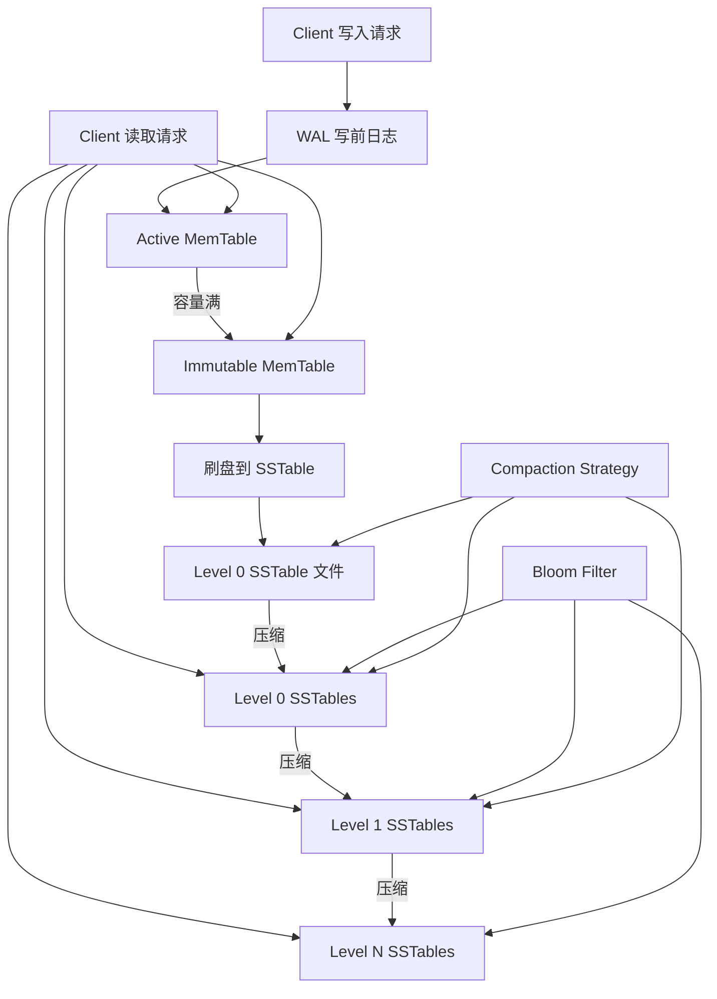
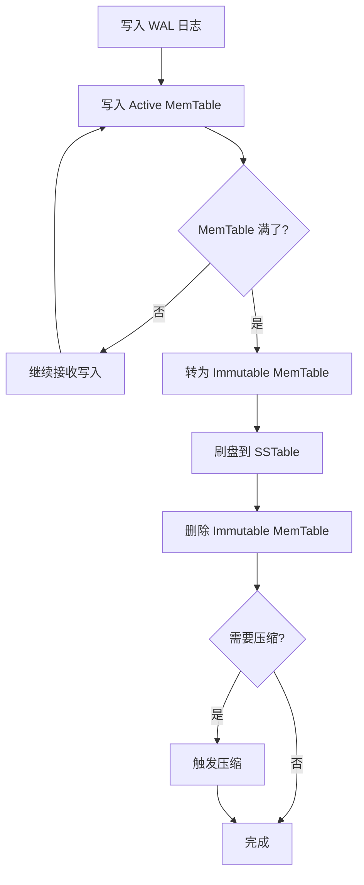
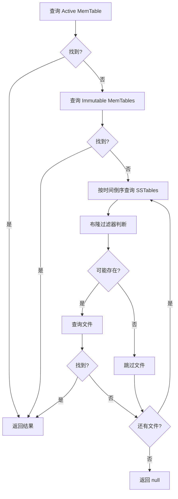

# 第1章：LSM Tree 概述

## 1. 什么是 LSM Tree？

**Log-Structured Merge Tree (LSM Tree)** 是一种专为写密集型工作负载优化的数据结构。它摒弃了传统数据库（如 MySQL）中 B+ 树的"原地更新"模式，转而采用"异地更新"和"批量写入"的策略。这种设计使得 LSM Tree 在处理海量数据的写入场景下表现卓越。

它被广泛应用于现代分布式数据库和键值存储系统中，例如：

- **LevelDB/RocksDB**: 单机高性能 KV 存储引擎
- **Cassandra/SBase**: 分布式宽列存储数据库
- **HBase**: 基于 HDFS 的分布式数据库
- **InfluxDB**: 时序数据库

> 简单来说，LSM Tree 特别适用于写多读少的场景，例如日志系统、订单流水、调用链记录、物联网传感器数据等。

### 1.1 核心设计思想

LSM Tree 的核心思想可以概括为以下三点：

- **将随机写入转换为顺序写入**: 利用磁盘（尤其是机械硬盘）顺序写性能远高于随机写的特性，将所有修改操作先追加写入日志和内存，再批量刷新到磁盘。
- **将写入操作与读取操作分离优化**: 写入路径主要优化吞吐量和延迟，读取路径通过分层结构和布隆过滤器进行优化。
- **通过多层存储结构平衡内存和磁盘的使用**: 这种分层结构（Memory -> Disk Level 0 -> Disk Level N）允许数据根据热度自然流动，热数据在内存，冷数据在底层磁盘。

---

## 2. LSM Tree vs 传统 B+ 树

我们来对比一下 LSM Tree 和 MySQL 使用的传统 B+ 树，这有助于理解 LSM Tree 的设计初衷：

| 特征         | B+ 树                                                                  | LSM Tree                                                           |
| ------------ | ---------------------------------------------------------------------- | ------------------------------------------------------------------ |
| **写入模式** | **原地更新 (In-place update)**：需要先找到位置再修改，产生大量随机 I/O | **异地更新 (Out-of-place update)**：追加写入新版本，全部为顺序 I/O |
| **写入性能** | **O(log N) 随机写**：受限于磁盘寻道时间，吞吐量较低                    | **O(log M) 顺序写** (M << N)：仅在内存中排序，磁盘写入接近带宽极限 |
| **读取性能** | **O(log N)**：索引结构紧凑，通常只需几次磁盘 I/O                       | **O(log N + K)**：可能需要查询多个文件，读取性能略低于 B+ 树       |
| **空间放大** | **低**：页分裂会导致部分碎片，但总体空间利用率高                       | **中等**：多版本数据共存，需要定期压缩回收空间                     |
| **写放大**   | **高**：修改少量数据可能导致整个页重写 (Double Write)                  | **低**：顺序写入，无页分裂开销（但压缩会带来写放大）               |
| **并发控制** | **复杂**：需要复杂的锁机制处理页分裂和合并                             | **简单**：SSTable 不可变，天然支持无锁并发读取                     |
| **适用场景** | **读多写少** (Read-Heavy)：如事务处理系统 (OLTP)                       | **写多读少** (Write-Heavy)：如日志、监控、海量数据摄入             |

---

## 3. LSM Tree 架构概览

### 3.1 系统架构图

```mermaid
graph TD
    A[Client 写入请求] --> B[WAL 写前日志]
    B --> C[Active MemTable]
    C -->|容量满| D[Immutable MemTable]
    D --> E[刷盘到 SSTable]
    E --> F[Level 0 SSTable 文件]

    G[Client 读取请求] --> C
    G --> D
    G --> H[Level 0 SSTables]
    G --> I[Level 1 SSTables]
    G --> J[Level N SSTables]

    F -->|压缩| H
    H -->|压缩| I
    I -->|压缩| J

    K[Bloom Filter] --> H
    K --> I
    K --> J

    L[Compaction Strategy] --> F
    L --> H
    L --> I
```

**图表说明**: 这个架构图展示了 LSM Tree 的完整数据流向和组件关系。

- **左侧 (写入路径)**: 客户端写入请求首先追加写入 WAL 日志（磁盘顺序写）以确保持久性，然后更新内存中的 Active MemTable。当 MemTable 容量满时，它会瞬间转换为 Immutable 状态（只读），并异步刷盘生成 SSTable 文件。
- **右侧 (读取路径)**: 读取请求遵循"由新到旧"的原则，依次查询 MemTable、Immutable MemTable 和各级 SSTable 文件。
- **底部 (后台处理)**: 压缩策略 (Compaction Strategy) 在后台持续运行，合并小文件为大文件，清理过期数据，并重建布隆过滤器。

这种设计实现了写入的高性能（将随机 I/O 转化为顺序 I/O）和读取的合理性能（通过分层查找和布隆过滤器优化）。

### 3.2 架构层次说明

**内存层 (Memory Layer)**：

- `WAL (Write-Ahead Log)`: 写前日志，记录所有尚未刷盘的操作。其作用是在系统崩溃重启时重放操作，防止数据丢失。
- `Active MemTable`: 当前活跃的内存表，接收所有新的写入请求。通常使用跳表 (SkipList) 实现，支持 O(log N) 的插入和查找。
- `Immutable MemTable`: 当 Active MemTable 满后转换而来，处于"冻结"状态，等待刷盘线程将其写入磁盘。它只读不写。

**磁盘层 (Disk Layer)**：

- `Level 0`: 直接从 MemTable 刷盘生成的 SSTable 文件。这一层的文件通常键范围会重叠 (Overlapping)，因此查询时可能需要遍历该层所有文件。
- `Level 1-N`: 通过后台压缩 (Compaction) 生成的分层 SSTable 文件。通常 Level 1 及以上层级的文件在同一层内键范围互不重叠，且数据更加紧凑有序。
- `Bloom Filter`: 附加在每个 SSTable 文件的元数据中，用于在读取文件内容前快速判断键是否**不可能**存在，从而避免昂贵的磁盘 I/O。

**后台进程 (Background Process)**：

- `Compaction Strategy`: 压缩策略，负责定期在后台合并多个 SSTable 文件。它是平衡读写放大和空间放大的关键机制。

### 3.3 数据流向

**写入路径**: `Client → WAL (Disk Append) → MemTable (RAM) → SSTable (Disk Flush) → Compaction (Disk Merge)`

**读取路径**: `Client → MemTable → Immutable MemTable → Level 0 SSTables → Level 1 SSTables → ... → Level N SSTables`

---

## 4. 核心组件详解

### 4.1 MemTable (内存表)

- **作用**: 内存中的有序数据结构，作为写入操作的第一站缓冲区。
- **实现**: 通常使用跳表 (`ConcurrentSkipListMap`) 或红黑树。跳表在并发场景下实现更简单且性能更优。
- **生命周期**: 从接收写入开始，直到达到容量阈值（如 64MB）变为不可变，最终刷盘后被销毁。

### 4.2 Immutable MemTable (不可变内存表)

- **作用**: 充当 Active MemTable 和磁盘之间的桥梁。
- **目的**: 它的存在使得 Active MemTable 可以立即清空并继续接收新写入，而不会被耗时的磁盘 I/O 阻塞。
- **特点**: 完全只读，一旦创建就不再修改。

### 4.3 SSTable (Sorted String Table)

- **作用**: LSM Tree 在磁盘上的持久化存储格式。
- **特点**:
  - **有序性**: 内部键值对按键排序，支持二分查找。
  - **不可变性**: 文件一旦写入磁盘，永远不会被修改（只能被新的合并文件替换）。这极大简化了并发控制和备份。
  - **自包含**: 文件内包含数据块、索引块和布隆过滤器。

### 4.4 WAL (Write-Ahead Log)

- **作用**: 数据的"保险箱"。
- **格式**: 通常是简单的追加写日志文件，包含操作类型（PUT/DELETE）、键、值和时间戳。
- **恢复**: 系统启动时，读取 WAL 重放所有未持久化到 SSTable 的操作到 MemTable 中。

### 4.5 Bloom Filter (布隆过滤器)

- **作用**: 空间效率极高的概率型数据结构，用于快速过滤不存在的键。
- **原理**: 使用多个哈希函数将键映射到位数组中。
- **效果**: 对于不存在的键，布隆过滤器能以 O(1) 的时间复杂度返回"绝对不存在"，从而跳过对应的 SSTable 文件读取，显著减少磁盘 I/O。

### 4.6 Compaction Strategy (压缩策略)

- **作用**: LSM Tree 的"垃圾回收"和"整理"机制。
- **目的**:
  - **减少文件数量**: 避免文件过多导致读取性能下降。
  - **清理数据**: 物理删除标记为删除（Tombstone）的数据和旧版本数据。
  - **优化布局**: 将 Level 0 的重叠文件合并为高层级的有序不重叠文件。

---

## 5. 数据流详解

### 5.1 写入流程

```mermaid
graph TD
    A[写入 WAL 日志] --> B[写入 Active MemTable]
    B --> C{MemTable 满了?}
    C -->|否| D[继续接收写入]
    C -->|是| E[转为 Immutable MemTable]
    E --> F[刷盘到 SSTable]
    F --> G[删除 Immutable MemTable]
    G --> H{需要压缩?}
    H -->|是| I[触发压缩]
    H -->|否| J[完成]
    I --> J
    D --> B
```

**写入流程说明**:

1. **日志先行 (WAL)**: 任何写入操作首先被追加到 WAL 文件中。这是一个顺序写操作，速度极快且保证了数据的持久性。
2. **内存更新 (MemTable)**: 随后数据被插入到内存中的 Active MemTable。这是一个内存操作，延迟极低（微秒级）。
3. **冻结与切换**: 当 MemTable 达到预设阈值（如 128MB），它会被原子性地标记为 Immutable MemTable，同时系统创建一个新的空 Active MemTable 接收后续写入。
4. **异步刷盘 (Flush)**: 后台线程将 Immutable MemTable 中的数据排序后写入磁盘，生成一个新的 Level 0 SSTable 文件。
5. **垃圾回收**: 刷盘完成后，对应的 WAL 日志片段和 Immutable MemTable 被释放。
6. **后台压缩**: 如果 SSTable 文件数量过多，触发压缩任务，将多个 SSTable 合并整理。

### 5.2 读取流程

```mermaid
graph TD
    A[查询 Active MemTable] --> B{找到?}
    B -->|是| C[返回结果]
    B -->|否| D[查询 Immutable MemTables]
    D --> E{找到?}
    E -->|是| C
    E -->|否| F[按时间倒序查询 SSTables]
    F --> G[布隆过滤器判断]
    G --> H{可能存在?}
    H -->|否| I[跳过文件]
    H -->|是| J[查询文件]
    J --> K{找到?}
    K -->|是| C
    K -->|否| L{还有文件?}
    L -->|是| F
    L -->|否| M[返回 null]
    I --> L
```

**读取流程说明**:
LSM Tree 的读取遵循**"最新优先"**原则，因为最新的数据版本覆盖旧版本。

1. **查内存**: 首先查询 Active MemTable，然后查询 Immutable MemTable。这部分完全在内存中进行，速度最快。
2. **查磁盘**: 如果内存中未找到，则需要查询磁盘上的 SSTable 文件。
3. **层级遍历**: 按照 Level 0 -> Level 1 -> ... -> Level N 的顺序查找。在 Level 0 中，需按文件生成时间倒序查找（因为文件间可能重叠）；在 Level 1+ 中，根据键范围定位具体文件。
4. **布隆过滤**: 在打开任何 SSTable 之前，先检查其附带的布隆过滤器。如果布隆过滤器说"不存在"，则直接跳过该文件（这一步过滤了 99% 的无效磁盘读取）。
5. **文件查找**: 只有通过布隆过滤器检查的文件，才会加载其索引块进行二分查找，最终读取数据块。

---

## 6. 性能特征

### 6.1 写入性能优势

- **极致的顺序写入**: 无论是 WAL 还是 SSTable 的生成，全部都是磁盘顺序写。在机械硬盘上，顺序写性能比随机写快 2-3 个数量级；在 SSD 上也有显著优势且能延长设备寿命。
- **批量刷盘**: 多个小的写入操作在内存中聚合成一个大的批量写入，大幅减少了 IOPS (每秒 I/O 次数) 的消耗。
- **高并发**: 写入主要发生在 MemTable，结合无锁跳表技术，可以支持极高的并发写入吞吐量。

### 6.2 读取性能考虑

- **读放大 (Read Amplification)**: 最坏情况下，读取一个 key 可能需要查询所有层级的所有 SSTable 文件。
- **优化手段**:
  - **布隆过滤器**: 极大缓解了读放大问题。
  - **SSTable 索引**: 文件内部的稀疏索引加速了块定位。
  - **Block Cache**: 缓存热点数据块，减少物理 I/O。
  - **Compaction**: 保持文件层级扁平，减少查找深度。

### 6.3 空间使用

- **空间放大 (Space Amplification)**: 由于 LSM Tree 是异地更新，旧数据和删除标记 (Tombstone) 会在磁盘上共存一段时间，直到压缩发生。这意味着存储空间可能会比实际数据量大。
- **写放大 (Write Amplification)**: 压缩过程需要读取旧文件并写出新文件，同一份数据在其生命周期内可能会被多次重写。这是 LSM Tree 为获得高写入性能和有序存储所付出的代价。

---

## 7. 实际应用场景

### 7.1 适合的场景 (Write-Intensive)

- ✅ **日志收集与监控**: 如 Prometheus, Logstash。数据以极高频率持续写入，读取通常是最近时间段的聚合查询。
- ✅ **用户行为追踪**: 记录点击流、浏览记录。数据量巨大且持续增长，主要侧重于写入吞吐量。
- ✅ **消息队列持久化**: 如 Kafka (虽然主要是 Log 结构，但原理相似)。保证消息不丢失且能快速堆积。
- ✅ **大容量 KV 存储**: 存储海量非关系型数据，如电商购物车、用户画像等。

### 7.2 不适合的场景 (Read-Intensive / Complex Transaction)

- ❌ **强一致性事务**: 涉及多行、多表的复杂 ACID 事务（虽然 RocksDB 支持事务，但比 B+ 树复杂）。
- ❌ **频繁的小范围更新**: 如果数据被频繁覆盖，会导致严重的写放大和压缩压力。
- ❌ **极为敏感的读取延迟**: 如果应用要求所有读取都在微秒级稳定返回，LSM Tree 的长尾延迟（受压缩影响）可能是个问题。

---

## 8. 核心优势

1. **高写入吞吐量**: 能够轻松达到数十万甚至百万级 ops/sec，是 B+ 树难以企及的。
2. **硬件友好**: 对磁盘（尤其是 HDD）非常友好，充分压榨顺序 I/O 性能。
3. **数据压缩率高**: SSTable 是不可变的且有序，非常适合使用 LZ4、Snappy 等算法进行块压缩，节省存储成本。
4. **灵活的一致性**: 可以通过调整 WAL 刷盘策略在性能和数据安全性之间做权衡。

---

## 9. 实现挑战

1. **Compaction 抖动**: 后台压缩任务会消耗大量的 CPU 和磁盘 I/O，可能导致前台读写请求出现延迟抖动 (Stall)。
2. **参数调优复杂**: 需要根据负载类型精细调整 MemTable 大小、Level 层级、压缩触发阈值等参数。
3. **空间回收延迟**: 删除的数据不会立即释放空间，必须等待压缩完成。

---

## 10. 下一步学习

现在你已经了解了 LSM Tree 的整体架构，接下来我们将深入学习各个组件的实现细节：

1. **KeyValue 数据结构** - 理解 LSM Tree 如何通过 KeyValue 封装来处理多版本和删除。
2. **MemTable 实现** - 深入学习跳表 (SkipList) 的原理及其在 Java 中的并发实现。
3. **SSTable 格式** - 探索磁盘文件的数据布局，包括索引块、数据块和元数据。

---

## 11. 思考题

1. **权衡思考**: 相比于 B+ 树，LSM Tree 牺牲了什么来换取极高的写入性能？
2. **布隆过滤器**: 如果布隆过滤器的假阳性率 (False Positive Rate) 设置得过高或过低，分别会有什么影响？
3. **压缩策略**: 在写入极快但磁盘 I/O 有限的场景下，应该如何调整压缩策略以避免"Write Stall"（写入停顿）？

**下一章预告**: 我们将学习 LSM Tree 的基础数据结构 KeyValue，理解时间戳、删除标记等核心概念。
